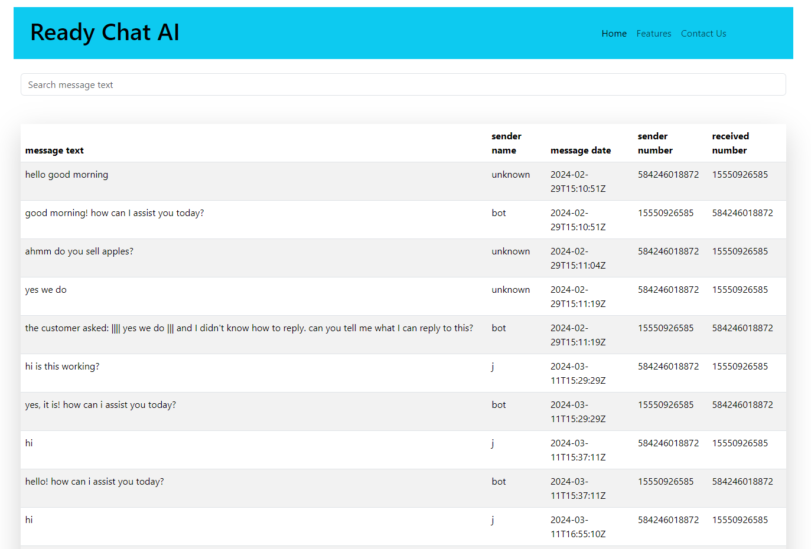
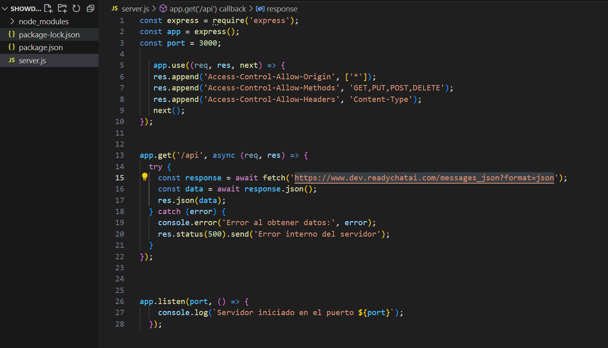
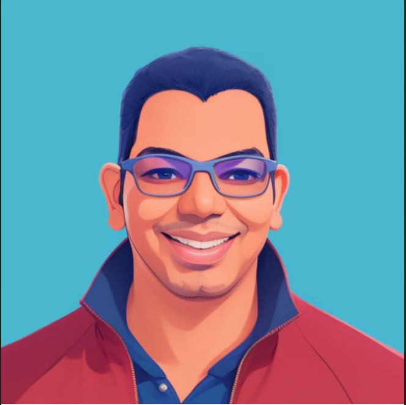

#  Databox: Tu panel de control personal para datos

## Descripcion General
En este proyecto decidí implementar bootstrap para aprender otra herramienta al desarrollo FrontEnd, junto a Tailwind Css y Chakra UI espero ser un desarrollador más integral, logre superar las restricciones de CORS creando un servidor y haciendo la solicitud desde el backend, agradezco la oportunidad y espero trabajar en una empresa con valres tan enfocados en el crecimiento de sus participantes.

### Screenshot

este es el backend que desarrolle para hacer la llamada desde mi front y luego desde el servidor hice la llama a la api proporcionadam con esto evite los errores de CORS.

- despliegue URL: [Vercel](https://show-data-gamma.vercel.app/)

## Reflección

Este proyecto me permitió explorar y profundizar en diversas tecnologías, incluyendo JavaScript, React Vite y Bootstrap, especialmente esta última, que abordé por primera vez.

A lo largo del proyecto, he adquirido una comprensión sólida de los principios fundamentales de JavaScript,  React y CORS. He aprendido a realizar peticiones HTTP a APIs externas, procesar y transformar datos JSON, y manejar el estado de la aplicación mediante el uso de hooks como useState y useEffect.

Asimismo, he podido explorar las capacidades de React, apreciando su simplicidad y eficiencia en el desarrollo de aplicaciones web modernas. La integración de Bootstrap me permitió crear una interfaz de usuario atractiva y receptiva, familiarizándome con esta biblioteca de estilos por primera vez.

### Agradecimiento y Compromiso:

Deseo expresar mi más sincero agradecimiento a Ready Chat AI por brindarme la oportunidad de participar en este proyecto desafiante y enriquecedor. He valorado enormemente la confianza depositada en mis habilidades y la posibilidad de contribuir al equipo de trabajo.

### Aporte de Habilidades Transversales:

Más allá de las habilidades técnicas adquiridas, me gustaría destacar que mi experiencia como abogado me ha permitido desarrollar capacidades transversales que considero valiosas para el equipo. Mi capacidad para resolver conflictos, comunicarme de manera efectiva, trabajo en equipo, gestionar el tiempo de forma eficiente y mantener una madurez emocional me convierten en un activo para el grupo de trabajo.

## Conclusión:

Este proyecto ha sido una experiencia gratificante que me ha permitido ampliar significativamente mis conocimientos en el ámbito del desarrollo web. Estoy comprometido con el continuo desarrollo de mis habilidades técnicas y la aplicación de mis aptitudes transversales para contribuir de manera significativa al equipo de Ready Chat AI.

Agradezco la atención prestada a esta reflexión.

Atentamente, Rodolfo Rodríguez

